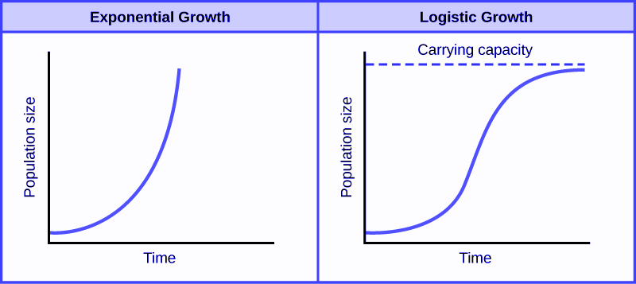
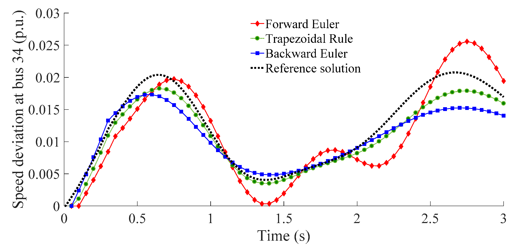
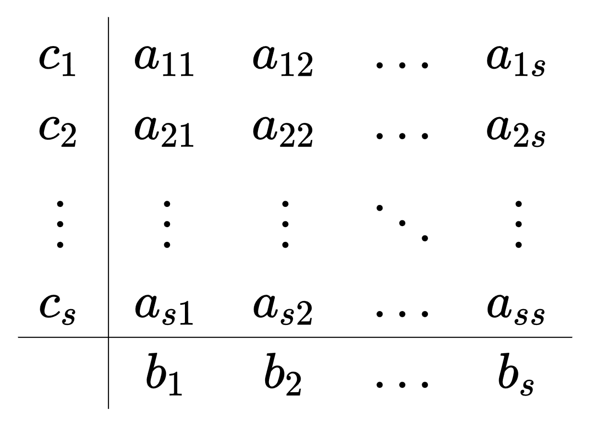
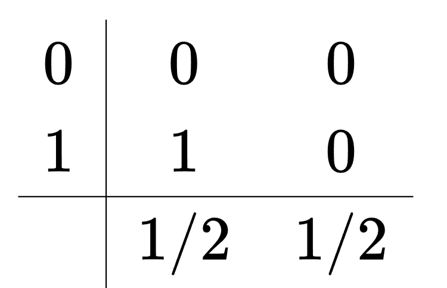
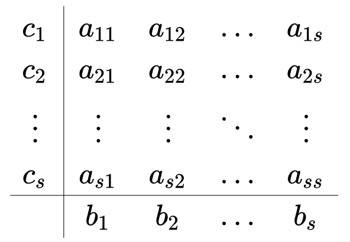

# Time Stepping Methods

## Table of Contents
- [Background](#Background)
- [ODEs and IVPs](#ODEs-and-IVPs)
- [Euler's Methods](#Euler's-Methods)
- [Runge-Kutta Methods](#Runge-Kutta)
- [PDEs](#PDEs)
- [References](#References)

## Background
Time Stepping refers to the practice of nuemrically estimating solutions to differential equations by using small increments of the function input. The outpus of those functions are then calculated using different methods ascribed below.

These approximations have been developed and used for quite some time, since the invention of Calculus by the likes of Newton and Leibniz. Following them, Taylor published the first study of difference equations, and then Euler developed his methods for solving IVPs in 1768. Later on, Cauchy refined his methods in 1840, and Adams published his multistep methods in 1883, and Runge, Heun, and Kutta developed the Runge-Kutta methods at the turn of the 19th century. [3]

## ODEs and IVPs
A [Differential Equation](https://en.wikipedia.org/wiki/Differential_equation) is an equation that describes the relationship between a certain function and how it changes, or to be more precise, its derivative(s). Differential equations are incredibly important as they are often used to model many different aspects of the natural world, from physical phenomena to financial markets.

An [Ordinary Differential Equation](https://en.wikipedia.org/wiki/Ordinary_differential_equation), or ODE, is a differential equation with only one dependent variable (usually $t$ for time). A simple, first-order ODE be seen below:
$$\frac{dy}{dt} = ky$$
This ODE is a first-order ODE because it only has the first derivative present. The order of a differential equation is equal to the highest-order derivative present. For the purposes of this explanation, we will stick to first-order derivatives, as higher-order ones can be expressed as a system of first-order derivatives. [Heath]
Given an initial condition of $y(0) = y_0$, we can solve the above differential equation to yield:
$$p(t) = e^{kt}y_0$$
Hence, this differential equation models exponential growth. A model like this can be used to approximate population size when the amount of resources is unlimited, and the population can grow infinitely. To improve our model, we can add a term that represents the death rate while also taking into account a finite amount of resources. In this case, the birth rate would still be proportional to the population size, and similarly so too will the death rate. However, the death rate (or population decline) will also increase again when the population increases, since fewer resources would be available. That yields the equation:
$$\frac{dy}{dt} = ky - ry^2$$
Solving this equation with the initial value defined before, you would get the logistic equation:
$$y(t) = \frac{k/r}{1+(\frac{1}{ry_0} - 1)e^-kt}$$
This is a much better approximator for population growth than the previous result, however it can be modified many times further to account for different variables that could affect a certain population.

The image above represents the difference between the two models we uncovered, and while these are fairly simple, with the addition of variables and considering different systems, ODEs get very complicated very quickly, and also become incredibly difficult to solve. However, they're still incredibly useful to model many different systems, and we still need some way to comprehend and predict using them, which is where time-stepping methods come into play.

## Euler's Methods
Let's redefine our first-order IVP to be more general:
$$y'(t) = f(t, y(t))$$
$$y(t_0) = y_0$$
Given this IVP, we need to approximate $y(t)$. Euler's methods rely on taking steps of size $h$ from $t_0$ to $t$, and approximating for each step what the resulting value would be. We can establish the following:
$$t_{k+1} = t_k + h = t_0 + {k+1}*h$$
Using [Taylor series](https://en.wikipedia.org/wiki/Taylor_series), we can define: [4]
$$y(t+h) = y(t) + hy'(t) + \frac{h^2}{2}y''(t) + ...$$
As $h$ increases, higher powers of $h$ tend to $0$, so we can truncate the end of the Taylor series for the following approximation:
$$y(t+h) \approx y(t) + hy'(t)$$
$$= y(t) + hf(t, y(t))$$
Rewritten:
$$y_{k+1} = y_k + hf(t_k, y_k)$$
This is known as Euler's Method. Starting at $y_0$, you can iterate through this method, using the tangent line at $(t_k, y_k)$ with slope $f(t_k, y_k)$ to approximate the next $y_{k+1}$. The amount of times you do this is $\frac{t_n - t_0)}{h}$ where $t_n$ is the value at which you want to approximate $y$. [3]

### Error of Euler's Method
Going back to our Taylor Series, the formula for our approximation plus remainder can be written as follows:
$$y(t+h) = y(t) + hy'(t) + \frac{h^2}{2}y''(\xi) + ...$$
(where $t \leq \xi \leq t + h$). Thus our local error, or the error for each iteration (step) of Euler's Method, is to the order of $h^2$, better written as $\mathcal{O}(h^2)$. The number of steps we take is proportional to $\frac{1}{h}$, so that means that the total global error is $\mathcal{O}(h^2 * \frac{1}{h})$ which is $\mathcal{O}(h)$.

Thus, Euler's Method is called a first-order method, and if $h$ isn't small enough, your error could be substantial. Global error is also not a direct sum of local errors. Depending on the nature of the local errors, in this method, they can compound on one another in certain situations, leading to instability and a global error that is larger than the sum of the local errors. [1]

On top of that, rounding errors can lead to poorer accuracy, and adding more terms from the Taylor series in our approximation would greatly increase the cost of the method, as it would require calculating $f'$ and $f''$. In general, our goal is to reduce the number of difficult calculations, while maintaining as much precision as possible.[4]

### Implicit Methods
Euler's Method, or Forward Euler's Method, is considered an explicit method, as the value we're looking for: $y_{k+1}$, is a direct output of the method that we can find by plugging in inputs. While this makes the implementation of the method simple, it also causes the method to be riddled with error as shown above. Instead, to reduce the amount of error, we can instead rely on information at time $t_{k+1}$ as an input, which would make the derived method implicit. Using that logic, we can define the Backward Euler's Method as follows:
$$y_{k+1} = y_k + h*f(t_{k+1}, y_{k+1})$$
This method can be derived in the same way as Euler's method is, except instead of using the left rectangle rule of a [Riemann Sum](https://en.wikipedia.org/wiki/Riemann_sum#:~:text=In%20mathematics%2C%20a%20Riemann%20sum,integral%20by%20a%20finite%20sum.), we use the right rectangle rule [3].
This method comes with the added complexity of having to solve an implicit method, rather than just being able to plug values in, but because we use $t_{k+1}$ to predict $y_{k+1}$, the method is inherently more stable than the forward Euler's Method. While the reason why is beyond the scope of this article, intuitively it's because the error cannot grow with every step like it can with forward Euler. If you want to learn more, there's a good description in [Numerical Analysis Using R](https://app.knovel.com/web/view/khtml/show.v/rcid:kpNAURSOD3/cid:kt010YD2J2/viewerType:khtml/root_slug:numerical-analysis-using/url_slug:stability-analysis-ode?&view=collapsed&zoom=1&page=1) by Graham Griffiths in Chapter 2.

There are also other implicit methods that can be derived from Euler's Methods such as the Trapezoid Method, which combines the forward and backward Euler's Methods:
$$y_{k+1} = y_k + h\frac{f(t_k, y_k) + f(t_{k+1}, y_{k+1})}{2}$$
This method follows the same principle as in the Trapezoidal Method in Numerical Quadrature, and leads to more accurate results than either method above. This is reflected in the fact that the Trapezoid Method is second order accurate, or $\mathcal{O}(h^2)$, meaning that the size of its error will scale with $h^2$ [3].
Overall, while implicit methods are costlier to compute for every iteration, they often will require a lot less iterations to compute a more accurate result, since they can be inherently stable whereas the explicit method can't.

## Runge-Kutta
As discussed earlier, one direct way to improve the accuracy of Euler's Methods would be to add more terms from the Taylor series, but that would greatly increaase the computational cost and be difficult to calculate the resulting derivatives of $f$. However, we can get around that. Consider the Taylor series again:
$$y_{k+1} = y_{k} + hy_{k}' + \frac{1}{2}h^2y_{h}'' + \mathcal{O}(h^3)$$
Since $y'(t) = f(t, y(t))$ from our original equation, that means $y''(t) = f'(t, y(t))$. As such:
$$y''(t) = f'(t, y(t)) = \frac{df}{dt} = \frac{\partial f}{\partial t} + \frac{\partial f}{\partial y} \frac{dy}{dt} = f_t + f_yf$$
After applying the [chain rule](https://en.wikipedia.org/wiki/Chain_rule), we can then plug that result back in to get:
$$y_{k+1} = y_{k} + hf(t_k, y_k) + \frac{1}{2}h^2[f_t(t_k, y_k) + f_y(t_k, y_k)f(t_k, y_k)] + \mathcal{O}(h^3)$$
$$= y_{k} + h[f(t_k, y_k) + \frac{h}{2}f_t(t_k, y_k) + \frac{h}{2}f_y(t_k, y_k)f(t_k, y_k)] + \mathcal{O}(h^3)$$
However, we still don't want to compute those partial derivatives: $f_t$ and $f_y$. Instead, we can apply the same Taylor Series concept now to $f$:
$$f(t + \alpha, y(t) + \beta) = f(t, y(t)) + \alpha f_t(t, y(t)) + \beta f_y(t, y(t)) + \mathcal{O}((\alpha + \beta)^2)$$
If we set $\alpha = \frac{h}{2}$ and $\beta = \frac{h}{2}f(t, y(t))$, we can substitute the above result into the original taylor series equation:
$$y_{k+1}= y_{k} + h[f(t + \alpha, y(t) + \beta)] + \mathcal{O}(h^3)$$
$$= y_{k} + hf(t_k + \frac{h}{2}, y_k + \frac{h}{2}f(t_k, y_k)) + \mathcal{O}(h(\alpha + \beta)^2 + h^3)$$
We can then truncate this to get the Improved Euler Method, which is the basis for the Runge-Kutte group of methods. Since $\alpha$ and $\beta$ are both defined in terms of $h$, we get the nice reduction: $\mathcal{O}(h(\alpha + \beta)^2 + h^3) = \mathcal{O}(h^3)$. This in turn means that the order of accuracy of this method is 2, and can be referred to IE2 [1]:
$$y_{k+1} = y_{k} + hf(t_k + \frac{h}{2}, y_k + \frac{h}{2}f(t_k, y_k))

### Multistage Methods
Runge-Kutta Methods are considered mutigstage methods, which means that for every step, we have multiple stages of calculations. In Improved Euler's Method, we have the first stage which takes the step from $t_k$ to $t_k + \frac{h}{2}$:
$$s_1 = hf(t_k, y_k)$$
$$v = y_k + \frac{s_1}{2}$$
Then we can do the second stage:
$$s_2 = hf(t_k + \frac{h}{2}, v)$$
$$y_{k+1} = y_k + s_2$$

We can generalize this to match Taylor expansions to higher orders of accuracy. While the [derivation](https://en.wikipedia.org/wiki/Runge%E2%80%93Kutta_methods) of these methods is outside the scope of this article, we can generalize to $n$ stages:
$$s_1 = hf(t_k, y_k)$$
$$s_2 = hf(t_k + c_1h, y_k + a_{11}k_1)$$
$$s_3 = hf(t_k + c_2h, y_k + a_{21}k_1 + a_{22}k_2)$$
$$...$$
$$s_n = hf(t_k + c_{n-1}h, y_k + a_{n-1,1}s_1 + ... + a_{n-1,n-1}s_{n-1})$$
$$y_{k+1} = y_k + b_1s_1 + ... b_ns_n \quad \quad  \text{[1]}$$
Thus, any Runge-Kutta Method can be represented by the number of stages $n$, and whatever the constants $a_{ij}, b_j, c_i$ are. These constants are often represented in Butcher tables like the following:

The following tables represent the 2nd order Improved Euler's Method (Heun's Method), and also the classic 4th Order Runge-Kutta Method. See [here](https://en.wikipedia.org/wiki/List_of_Runge%E2%80%93Kutta_methods) for more RK methods.

## Multi-Step Methods

## PDEs

## References

1. Driscoll, T. A., &amp; Braun, R. J. (2017). Initial-value problems for ODEs. In Fundamentals of Numerical Computation. essay, Society for Industrial and Applied Mathematics. Retrieved from https://fncbook.github.io/fnc/frontmatter.html. 
2. Griffiths, G. W. (2016). ODE Integration Methods and Stability Analysis of ODE Integrators. In Numerical Analysis Using R: Solutions to ODEs and PDEs (pp. 1–101). essay, Cambridge University Press. Retrieved from https://app.knovel.com/web/view/khtml/show.v/rcid:kpNAURSOD3/cid:kt010YD1G2/viewerType:khtml/root_slug:numerical-analysis-using/url_slug:front-matter?&amp;b-toc-cid=kpNAURSOD3&amp;b-toc-root-slug=numerical-analysis-using&amp;b-toc-title=Numerical%20Analysis%20Using%20R%20-%20Solutions%20to%20ODEs%20and%20PDEs&amp;b-toc-url-slug=ode-integration-methods&amp;kpromoter=federation&amp;view=collapsed&amp;zoom=1&amp;page=1. 
3. Heath, M. T. (2018). In Scientific computing: An introductory survey (pp. 381–420). essay, Society for Industrial and Applied Mathematics. 
4. Kreyszig, E., Kreyszig, H., &amp; Norminton, E. (2010). Chapter 21: Numerics for ODEs and PDEs. In Advanced Engineering Mathematics, 10th edition (pp. 900–948). essay, John Wiley and Sons.
